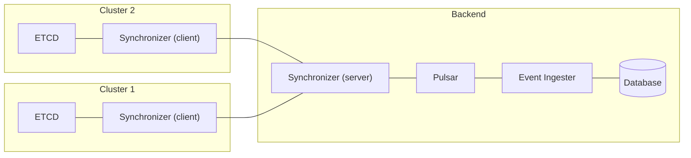

# Synchronizer

The Synchronizer serves as a data synchronization engine between in-cluster and backend resources, designed to facilitate bi-directional data synchronization between the two. It operates as an efficient event-driven data pipeline, actively monitoring a predefined list of resources for any changes. When changes occur, it efficiently propagates these updates to the relevant endpoints.



## Running the synchronizer locally

1. Run pulsar:

    ```sh
    ./scripts/pulsar.sh
    ```

2. Start synchronizer server:

    ```sh
    CONFIG=./configuration/server go run cmd/server/main.go
    ```

3. Start synchronizer client:

    ```sh
    CONFIG=./configuration/client go run cmd/client/main.go
    ```
